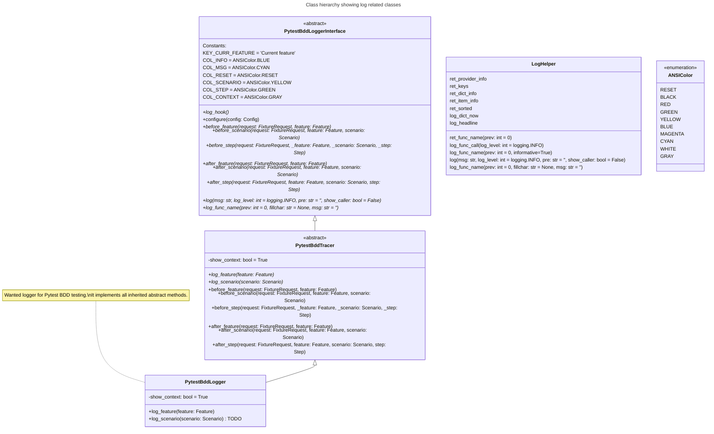

# bdd_tests

Is a project to learn Pytest-BDD

---

Built with help from AI tools:

* [You.com](https://you.com)
* [Codeium.com](https://codeium.com)

## Classes



<!-- ```mermaid

---

title: Animal example

---
classDiagram
    note "From Duck till Zebra"
    Animal <|-- Duck
    note for Duck "can fly\ncan swim\ncan dive\ncan help in debugging"
    Animal <|-- Fish
    Animal <|-- Zebra
    Animal : +int age
    Animal : +String gender
    Animal: +isMammal()
    Animal: +mate()
    class Duck{
        +String beakColor
        +swim()
        +quack()
    }
    class Fish{
        -int sizeInFeet
        -canEat()
    }
    class Zebra{
        +bool is_wild
        +run()
    }
``` -->
